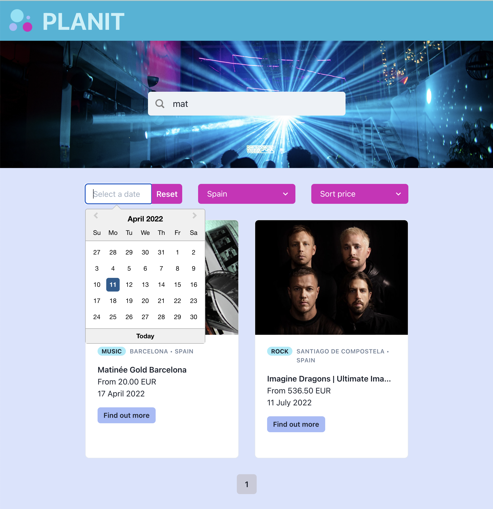

# PLANIT - Online Event Search Website

An online event searching database, pulling events from the Ticketmaster API. Clients can browse events from various countries that are supported markets with Ticketmaster. Each event has an event card with basic information and a link to the Ticketmaster website if they wish to see more information or buy tickets.
Events can be filtered by:

-   Date - using a datepicker
-   Price
-   Country (the website uses geolocation to load events from the user's current location as a default)
-   Keyword search

## Screenshot of PLANIT website

## Screenshot of calendar and search functions

## Dependencies

This project uses the following systems:

-   [Stripe](https://developer.ticketmaster.com/products-and-docs/apis/getting-started/)
-   [React](https://github.com/facebook/react)
-   [Chakra](https://chakra-ui.com/)
-   [Luxon](https://moment.github.io/luxon/#/)
-   [node-geohash](https://www.npmjs.com/package/ngeohash)
-   [React Date Picker](https://www.npmjs.com/package/react-datepicker)

## Dev dependencies

-   [Prettier](https://prettier.io/)
-   [Stylelint](https://stylelint.io/)

## Prerequisites

-   [Node](https://nodejs.org/)

## Local development

1. Run `npm install`
2. Run `npm start` to start the development server
3. Open `src/App.js` to get started

## Deployed applications

-   [PLANIT](https://planitevents.netlify.app/)

## Citations

-   Header image from: [Unsplash - Photo by Med Mhamdi](https://unsplash.com/photos/mH_E0K581Yk)
-   Logo created on: [Canva](https://www.canva.com/)
-   Favicon created on: [Canva](https://www.canva.com/)
